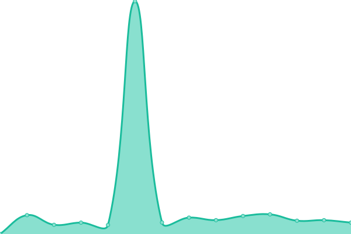

# [📈 Live Status](https://Truxnell.github.io/upptime): <!--live status--> **🟧 Partial outage**

This repository contains the open-source uptime monitor and status page for [Truxnell](www.voltaicforge.com), powered by [Upptime](https://github.com/upptime/upptime).

With [Upptime](https://upptime.js.org), you can get your own unlimited and free uptime monitor and status page, powered entirely by a GitHub repository. We use [Issues](https://github.com/Truxnell/upptime/issues) as incident reports, [Actions](https://github.com/Truxnell/upptime/actions) as uptime monitors, and [Pages](https://Truxnell.github.io/upptime) for the status page.

<!--start: status pages-->
<!-- This summary is generated by Upptime (https://github.com/upptime/upptime) -->
<!-- Do not edit this manually, your changes will be overwritten -->
<!-- prettier-ignore -->
| URL | Status | History | Response Time | Uptime |
| --- | ------ | ------- | ------------- | ------ |
|  [Voltaicforge](https://www.voltaicforge.com) | 🟩 Up | [voltaicforge.yml](https://github.com/Truxnell/upptime/commits/HEAD/history/voltaicforge.yml) | 

 314ms
     
 | 

<a href="https://status.voltaicforge.com/history/voltaicforge">98.21%</a>
    

|  [k8s mkdoc](https://k8s.voltaicforge.com) | 🟩 Up | [k8s-mkdoc.yml](https://github.com/Truxnell/upptime/commits/HEAD/history/k8s-mkdoc.yml) | 

 159ms
     
 | 

<a href="https://status.voltaicforge.com/history/k8s-mkdoc">98.21%</a>
    

|  [Status](https://status.voltaicforge.com) | 🟩 Up | [status.yml](https://github.com/Truxnell/upptime/commits/HEAD/history/status.yml) | 

 143ms
     
 | 

<a href="https://status.voltaicforge.com/history/status">93.46%</a>
    

|  Flux Webhook | 🟩 Up | [flux-webhook.yml](https://github.com/Truxnell/upptime/commits/HEAD/history/flux-webhook.yml) | 

 721ms
     
 | 

<a href="https://status.voltaicforge.com/history/flux-webhook">99.72%</a>
    

|  Plex | 🟩 Up | [plex.yml](https://github.com/Truxnell/upptime/commits/HEAD/history/plex.yml) | 

 821ms
     
 | 

<a href="https://status.voltaicforge.com/history/plex">98.68%</a>
    

|  Home Assistant | 🟥 Down | [home-assistant.yml](https://github.com/Truxnell/upptime/commits/HEAD/history/home-assistant.yml) | 

 752ms
     
 | 

<a href="https://status.voltaicforge.com/history/home-assistant">99.16%</a>
    

|  Vaultwarden | 🟩 Up | [vaultwarden.yml](https://github.com/Truxnell/upptime/commits/HEAD/history/vaultwarden.yml) | 

 695ms
     
 | 

<a href="https://status.voltaicforge.com/history/vaultwarden">99.74%</a>
    

|  Joplin | 🟩 Up | [joplin.yml](https://github.com/Truxnell/upptime/commits/HEAD/history/joplin.yml) | 

 925ms
     
 | 

<a href="https://status.voltaicforge.com/history/joplin">99.74%</a>
    

<!--end: status pages-->

[**Visit our status website →**](https://Truxnell.github.io/upptime)

## 📄 License

- Powered by: [Upptime](https://github.com/upptime/upptime)
- Code: [MIT](./LICENSE) © [Truxnell](www.voltaicforge.com)
- Data in the `./history` directory: [Open Database License](https://opendatacommons.org/licenses/odbl/1-0/)
